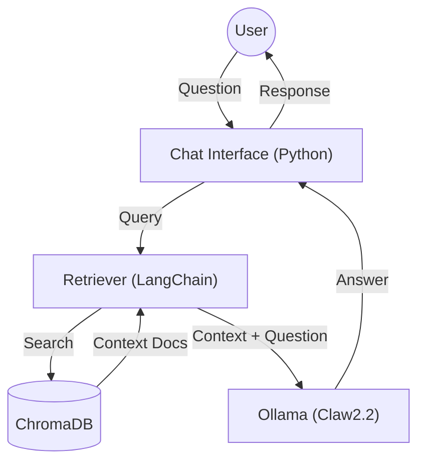

# NetOps RAG (Claw2.2 Edition) 🧠✨

Local RAG (Retrieval-Augmented Generation) system designed for Network Operations, powered by **Ollama** & **Claw2.2** (Custom Llama-3 Persona).

## 🚀 Features
- **Anti-Hallucination:** Strictly answers based on provided context (Markdown docs).
- **RouterOS v7 Ready:** Knows the difference between Mikrotik v7 and Cisco IOS.
- **Local Privacy:** Runs 100% offline using Docker & Ollama.
- **Indonesian Persona:** Responds in casual Bahasa Indonesia ("Bos", "Gan").

## 🛠️ Prerequisites
1. **Ollama** installed on host machine.
2. **Model `claw2.2`** created (see `../modelfiles/Modelfile.v2.2`).
3. **Docker & Docker Compose**.

## 📂 Directory Structure
```
netops-rag/
├── data/               # Knowledge Base (Markdown/Text files)
├── src/
│   ├── ingest.py       # Script to embed & save docs to VectorDB
│   └── chat_rag.py     # Script to query RAG
├── chroma_db/          # Vector Database (Auto-generated)
├── Dockerfile          # Python Environment
└── docker-compose.yml  # Orchestration
```

## 🏗️ Architecture



1.  **Ingestion:** Markdown files -> Split -> Embed (Llama3) -> ChromaDB.
2.  **Retrieval:** User Query -> Embed -> Search ChromaDB (Top-K) -> Context.
3.  **Generation:** Context + Query -> Prompt Template (Strict) -> Ollama (Claw2.2) -> Answer.

## ⚡ Quick Start

### 1. Build Environment
```bash
docker compose build
```

### 2. Ingest Knowledge (Teach Claw)
Put your Markdown files in `data/`, then run:
```bash
docker compose up ingest
```
*This will parse docs and save them to `chroma_db/`.*

### 3. Chat with Claw
Ask technical questions:
```bash
docker compose run --rm chat python src/chat_rag.py "Bagaimana cara set BGP di Mikrotik v7?"
```

## 📝 Configuration
- **Model:** Change `MODEL_NAME` in `src/chat_rag.py` (Default: `claw2.2`).
- **Retrieval:** Adjust `k` value in `src/chat_rag.py` (Default: `k=5` chunks).
- **Prompt:** Edit `PROMPT_TEMPLATE` in `src/chat_rag.py` to change persona/strictness.

## ⚠️ Notes
- Ensure Ollama is running on host (`systemctl start ollama`).
- Docker container accesses host network via `host.docker.internal`.
