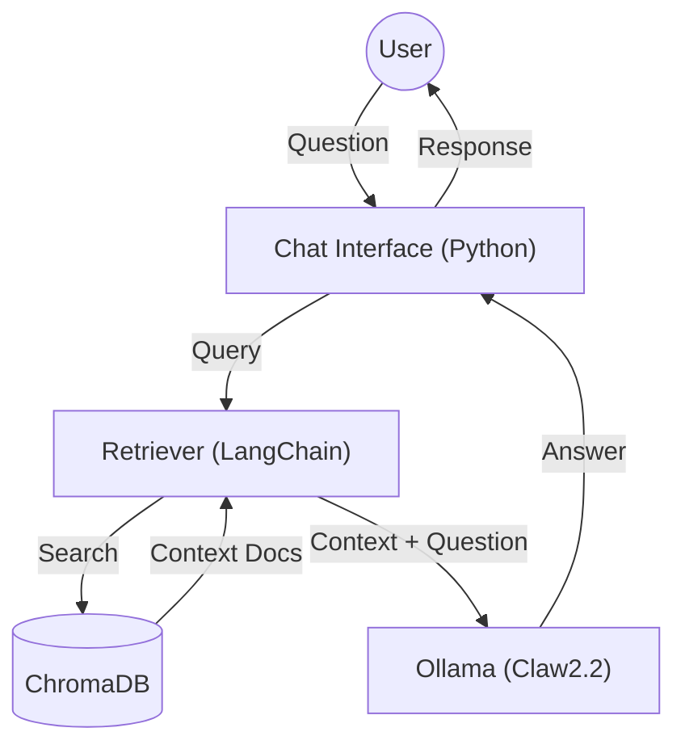

# NetOps RAG (Claw2.2 Edition) 🧠✨

Sistem RAG (Retrieval-Augmented Generation) lokal yang dirancang khusus untuk Network Operations, ditenagai oleh **Ollama** & **Claw2.2** (Persona Custom Llama-3).

## 🚀 Fitur
- **Anti-Hallucination:** Jawaban hanya berdasarkan context yang diberikan (dokumen Markdown).
- **RouterOS v7 Ready:** Paham perbedaan antara Mikrotik v7 dan Cisco IOS.
- **Local Privacy:** Jalan 100% offline menggunakan Docker & Ollama.
- **Indonesian Persona:** Menjawab dengan gaya bahasa santai khas anak jaringan ("Bos", "Gan").

## 🛠️ Prasyarat
1.  **Ollama** terinstal di mesin host.
2.  **Model `claw2.2`** sudah dibuat (cek `../modelfiles/Modelfile.v2.2`).
3.  **Docker & Docker Compose**.

## 📂 Struktur Direktori
```
netops-rag/
├── data/               # Knowledge Base (File Markdown/Text)
├── src/
│   ├── ingest.py       # Script untuk embed & simpan dokumen ke VectorDB
│   └── chat_rag.py     # Script untuk query RAG
├── chroma_db/          # Vector Database (Otomatis dibuat)
├── Dockerfile          # Environment Python
└── docker-compose.yml  # Orchestration
```

## 🏗️ Arsitektur



1.  **Ingestion:** File Markdown -> Split -> Embed (Llama3) -> ChromaDB.
2.  **Retrieval:** User Query -> Embed -> Search ChromaDB (Top-K) -> Context.
3.  **Generation:** Context + Query -> Prompt Template (Strict) -> Ollama (Claw2.2) -> Answer.

## ⚡ Quick Start

### 1. Build Environment
```bash
docker compose build
```

### 2. Ingest Knowledge (Kasih Ilmu ke Claw)
Taruh file Markdown kamu di `data/`, lalu jalankan:
```bash
docker compose up ingest
```
*Ini akan melakukan parsing dokumen dan menyimpannya ke `chroma_db/`.*

### 3. Chat dengan Claw
Ajukan pertanyaan teknis:
```bash
docker compose run --rm chat python src/chat_rag.py "Bagaimana cara set BGP di Mikrotik v7?"
```

## 📝 Konfigurasi
- **Model:** Ubah `MODEL_NAME` di `src/chat_rag.py` (Default: `claw2.2`).
- **Retrieval:** Atur nilai `k` di `src/chat_rag.py` (Default: `k=5` chunks).
- **Prompt:** Edit `PROMPT_TEMPLATE` di `src/chat_rag.py` untuk mengubah persona/strictness.

## ⚠️ Catatan
- Pastikan Ollama sudah jalan di host (`systemctl start ollama`).
- Container Docker mengakses host network via `host.docker.internal`.
