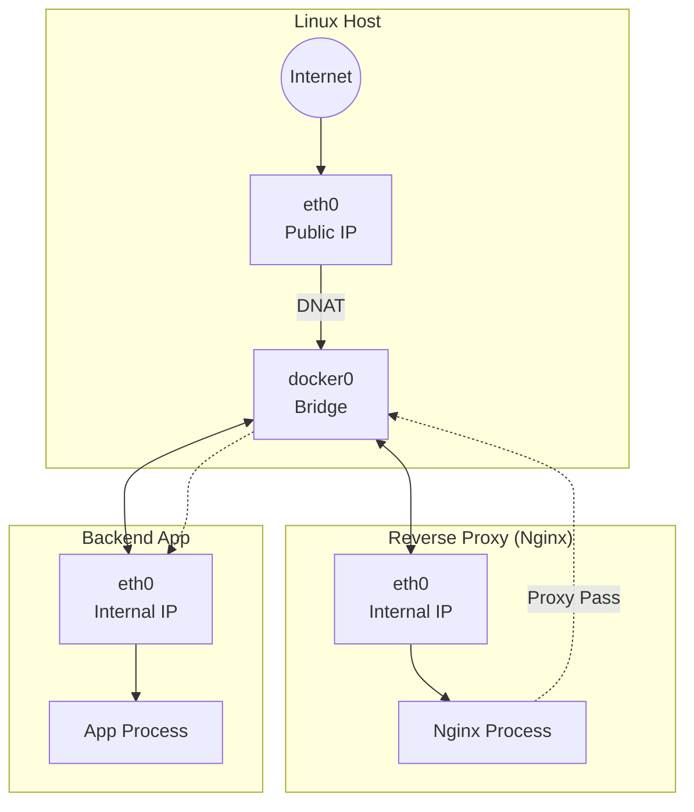

# Reverse Proxy & WAF Concepts

**Reverse Proxy** adalah server perantara yang berdiri di antara client (pengguna) dan server backend (aplikasi). Sedangkan **WAF (Web Application Firewall)** adalah lapisan keamanan tambahan yang bertugas memfilter trafik berbahaya pada level aplikasi.

Materi ini disusun untuk memberikan pemahaman mendalam tentang arsitektur, fungsi, dan urgensi penggunaan kedua teknologi tersebut dalam infrastruktur modern.

## Usecase Analogy

Untuk mempermudah pemahaman konsep abstrak ini, kita akan menggunakan dua analogi utama: Restoran Mewah dan Pengiriman Surat.

### 1. The Restaurant Model 🍽️
Bayangkan sebuah restoran yang sangat sibuk.
*   **Client (User):** Pelanggan yang duduk di meja makan.
*   **Backend Server:** Koki yang memasak di dapur tertutup.
*   **Reverse Proxy:** **Pelayan (Waiter)** yang menjadi perantara.
*   **WAF:** **Satpam** yang memeriksa isi pesanan.

**Skenario Tanpa Proxy:** Pelanggan masuk ke dapur sendiri. Dapur kacau, resep rahasia dicuri, koki stress.
**Skenario Dengan Proxy:** Pelanggan hanya berinteraksi dengan Pelayan. Dapur aman, higienis, dan teratur.

### 2. The Letter Analogy (OSI Layer) ✉️
Bayangkan proses mengirim surat lamaran kerja.
*   **Network Firewall (Layer 3/4):** Hanya melihat "Amplop". Cek alamat pengirim & penerima. Tidak tahu isinya.
*   **WAF (Layer 7):** Membuka amplop dan membaca "Isi Surat". Jika isinya ancaman atau virus, surat dibakar.

## Architecture Design

Bagian ini menjelaskan visualisasi teknis bagaimana Reverse Proxy bekerja dalam jaringan.

### Network Topology
Berikut gambaran alur data dari Internet masuk ke Server melalui Reverse Proxy.



### Component Architecture
Reverse Proxy modern seperti Nginx bukan sekadar penerus paket, tapi memiliki modul cerdas.

```mermaid
componentDiagram
    component "Client Browser" as Client
    package "Reverse Proxy" {
        component "SSL Terminator" as SSL
        component "Load Balancer" as LB
        component "Static Cache" as Cache
    }
    package "Backend Cluster" {
        component "App Server A" as AppA
        component "App Server B" as AppB
    }
    
    Client --> SSL : HTTPS
    SSL --> Cache : Check Content
    SSL --> LB : If Miss
    LB ..> AppA : Round Robin
    LB ..> AppB : Round Robin
```

## Core Concepts

### OSI Layer 1-7 Review
Posisi WAF dan Reverse Proxy ada di lapisan tertinggi (Layer 7).

| Layer | Nama | Fokus Data | Analogi Surat | Perangkat |
| :--- | :--- | :--- | :--- | :--- |
| **7** | **Application** | **Data (Isi)** | **Isi Surat** (CV). WAF bekerja di sini. | HTTP, **WAF** |
| **4** | **Transport** | Segmen | **Metode Kirim** (Kilat/Biasa). | TCP, UDP |
| **3** | **Network** | Paket | **Alamat Tujuan**. Firewall biasa di sini. | IP, **Router** |
| **1** | **Physical** | Bit | **Jalan Raya**. | Kabel, Fiber |

### Forward Proxy vs Reverse Proxy
Sering tertukar, namun prinsipnya berbeda pada "Siapa yang dilindungi?".

1.  **Forward Proxy (Pelindung Client):** Menyembunyikan identitas user dari internet (contoh: VPN). *"Server tidak tahu siapa Client aslinya."*
2.  **Reverse Proxy (Pelindung Server):** Menyembunyikan identitas server dari internet. *"Client tidak tahu siapa Server aslinya."*

## Features & Algorithms

### Load Balancing
Bagaimana membagi beban ke banyak server?
*   **Round Robin:** Giliran (A -> B -> C -> A). Paling standar.
*   **Least Connections:** Kirim ke server yang paling sepi.
*   **IP Hash:** User X selalu dikirim ke Server A (untuk menjaga sesi login).

### SSL Termination
Mengapa HTTPS diurus di depan?
Enkripsi itu berat. Biarkan Reverse Proxy yang capek melakukan enkripsi/dekripsi (SSL Handshake), sehingga Backend Server bisa fokus memproses logika aplikasi dengan ringan (HTTP biasa).

## Summary

Penerapan Reverse Proxy dan WAF adalah standar wajib arsitektur web modern.
1.  **Reverse Proxy:** Mengelola lalu lintas, membagi beban, dan menyembunyikan topologi.
2.  **WAF:** Menyaring isi paket berbahaya (SQLi, XSS) di Layer 7.
Kombinasi keduanya menjamin aplikasi yang **Aman**, **Cepat**, dan **High Availability**.
