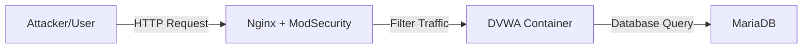

# Reverse Proxy & WAF Implementation

**Nginx** merupakan salah satu web server yang sangat populer digunakan sebagai Reverse Proxy. Ketika dikombinasikan dengan **ModSecurity**, ia berfungsi sebagai WAF (Web Application Firewall) yang tangguh. Secara umum, implementasi ini berfungsi untuk menyembunyikan identitas server asli dan memfilter trafik berbahaya (seperti SQL Injection atau XSS) sebelum mencapai aplikasi utama.

## Usecase

Skenario yang akan dijalankan adalah mengamankan sebuah aplikasi web yang sengaja dibuat rentan (vulnerable) menggunakan WAF. Trafik dari pengguna tidak akan mengakses aplikasi secara langsung, melainkan harus melewati Reverse Proxy yang sudah dipasangi filter keamanan.

Gambaran arsitektur yang akan disimulasikan adalah sebagai berikut.

### The Vulnerable App (DVWA)
Aplikasi yang akan dilindungi adalah **DVWA (Damn Vulnerable Web App)**. Aplikasi ini memiliki banyak celah keamanan standar seperti SQL Injection, XSS, dan Brute Force. Kita akan menggunakan DVWA sebagai backend untuk membuktikan efektivitas WAF.

Source Code: `ghcr.io/digininja/dvwa`

### Architecture Design
Bagian ini menjelaskan topologi lab yang akan dibangun.



Berdasarkan gambar diatas, User hanya bisa mengakses IP/Port dari WAF. Akses langsung ke DVWA akan ditutup (diisolasi dalam jaringan internal Docker).

## Lab Environment Setup

Sebelum melakukan setup pada bagian aplikasi, siapkan terlebih dahulu lingkungan kerja. Pada contoh ini, kita menggunakan **Docker** dan **Docker Compose** untuk memudahkan orkestrasi container.

### Install Docker
Jika belum terpasang, jalankan perintah berikut untuk melakukan installasi Docker pada Ubuntu.

```bash
sudo apt update
sudo apt install apt-transport-https ca-certificates curl software-properties-common -y
sudo curl -fsSL https://download.docker.com/linux/ubuntu/gpg -o /etc/apt/keyrings/docker.asc
echo "deb [arch=$(dpkg --print-architecture) signed-by=/etc/apt/keyrings/docker.asc] https://download.docker.com/linux/ubuntu $(. /etc/os-release && echo "$VERSION_CODENAME") stable" | sudo tee /etc/apt/sources.list.d/docker.list > /dev/null
sudo apt update
sudo apt-get install docker-ce docker-ce-cli containerd.io docker-buildx-plugin docker-compose-plugin -y
```

## Application Setup (Backend)

Bagian ini berfokus pada deployment aplikasi backend (DVWA) dan databasenya.

### Create Project Directory
Buat direktori kerja untuk menyimpan konfigurasi lab.

```bash
mkdir -p lab-sec/modsec
cd lab-sec
```

### Database & App Configuration
Untuk menjalankan DVWA, kita membutuhkan database MySQL/MariaDB. Buatkan file `docker-compose.yaml` awal dengan konfigurasi sebagai berikut.

```yaml
services:
  # Database Service
  dvwa-db:
    image: docker.io/library/mariadb:10
    container_name: lab-dvwa-db
    environment:
      - MYSQL_ROOT_PASSWORD=dvwa
      - MYSQL_DATABASE=dvwa
      - MYSQL_USER=dvwa
      - MYSQL_PASSWORD=p@ssw0rd
    volumes:
      - dvwa-data:/var/lib/mysql
    networks:
      - lab-network
    restart: unless-stopped

  # Application Service (Backend)
  dvwa:
    image: ghcr.io/digininja/dvwa:latest
    container_name: lab-dvwa
    environment:
      - DB_SERVER=dvwa-db
      - MYSQL_DATABASE=dvwa
      - MYSQL_USER=dvwa
      - MYSQL_PASSWORD=p@ssw0rd
    depends_on:
      - dvwa-db
    networks:
      - lab-network
    restart: unless-stopped
    # Note: Kita TIDAK expose port 80 ke host, agar user tidak bisa bypass WAF.

networks:
  lab-network:
    driver: bridge

volumes:
  dvwa-data:
```

Pada tahap ini, aplikasi DVWA sudah berjalan di dalam jaringan docker `lab-network` namun belum bisa diakses dari luar.

## Reverse Proxy & WAF Setup

Bagian ini menjelaskan konfigurasi Nginx sebagai Reverse Proxy yang dilengkapi modul ModSecurity.

### WAF Configuration File
Kita perlu menyiapkan file konfigurasi Nginx yang mengaktifkan ModSecurity. Buat file `modsec/main.conf` dengan isi sebagai berikut untuk mengaktifkan aturan dasar.

```nginx
# Enable ModSecurity
SecRuleEngine On

# Default Action: Deny and Log (403 Forbidden)
SecDefaultAction "phase:1,log,auditlog,deny,status:403"

# Basic SQL Injection Rule (Contoh Sederhana)
SecRule ARGS "@detectSQLi" "id:1001,phase:2,t:none,t:urlDecodeUni,block,msg:'SQL Injection Detected'"
```

### Update Docker Compose
Update file `docker-compose.yaml` untuk menambahkan service WAF (Nginx + ModSecurity). Kita akan menggunakan image `owasp/modsecurity-crs` yang sudah memuat Core Rule Set standar industri.

```yaml
  # ... service db dan dvwa sebelumnya ...

  # WAF Service (Reverse Proxy)
  waf:
    image: owasp/modsecurity-crs:nginx
    container_name: lab-waf
    ports:
      - "80:80" # Expose port 80 ke Host
    environment:
      - PROXY=1
      - BACKEND=http://dvwa:80 # Arahkan trafik ke container DVWA
      - PARANOIA=1
    volumes:
      # Mount custom rule jika ada
      - ./modsec/main.conf:/etc/modsecurity.d/setup.conf
    depends_on:
      - dvwa
    networks:
      - lab-network
    restart: unless-stopped
```

### Running Up
Setelah semuanya dikonfigurasi, jalankan lab menggunakan perintah berikut.

```bash
docker compose up -d
```

Gunakan perintah `docker compose ps` untuk memastikan ketiga container (`lab-dvwa`, `lab-dvwa-db`, `lab-waf`) sudah berjalan dengan status Up.

## Security Testing

Bagian ini akan menguji efektivitas WAF dalam memblokir serangan.

### Normal Access Testing
Buka browser dan akses alamat `http://localhost`. Anda seharusnya melihat halaman login DVWA. Ini membuktikan bahwa Reverse Proxy (Nginx) berhasil meneruskan trafik ke Backend (DVWA).

Lakukan setup database DVWA dengan klik tombol "Create / Reset Database" pada halaman setup.

### Attack Simulation (SQL Injection)
Masuk ke menu **SQL Injection** di dalam DVWA.
Coba masukkan payload serangan berikut pada kolom User ID:

```sql
' OR '1'='1
```

Jika **Tanpa WAF**, payload ini akan menampilkan seluruh daftar user di database.
Namun, **Dengan WAF**, hasil yang diharapkan adalah halaman Error **403 Forbidden**.

### Log Analysis
Untuk memverifikasi bahwa blokir dilakukan oleh WAF, cek log container WAF.

```bash
docker logs -f lab-waf
```

Anda akan melihat log seperti berikut:
`[client 172.18.0.1] ModSecurity: Access denied with code 403... [msg "SQL Injection Detected"]`

## Summary

Pada skenario ini, penerapan Reverse Proxy dan WAF berhasil mengamankan aplikasi backend yang rentan.
1.  **Reverse Proxy** berhasil menyembunyikan topologi backend dan menjadi satu-satunya pintu masuk.
2.  **WAF (ModSecurity)** berhasil mendeteksi pola serangan SQL Injection pada Layer 7 dan memblokirnya sebelum mencapai aplikasi.

Dengan arsitektur ini, celah keamanan pada aplikasi (vulnerability) dapat ditambal secara virtual (*Virtual Patching*) oleh WAF tanpa harus mengubah kode aplikasi secara langsung.
